# Y-다나와 ERD

```mermaid
erDiagram

    books {
        VARCHAR(32)   isbn           PK
        VARCHAR(255)  title          "NOT NULL"
        VARCHAR(500)  title_norm     "검색용 정규화 (소문자+NFKC)"
        VARCHAR(255)  author
        VARCHAR(255)  publisher
        VARCHAR(2048) image_url
        DATE          published_date
        DOUBLE        price
        TIMESTAMPTZ   created_at     "NOT NULL"
        TIMESTAMPTZ   updated_at     "NOT NULL"
    }

    book_image {
        BIGSERIAL    id             PK
        VARCHAR(32)  book_isbn      FK
        VARCHAR(50)  kind           "cover / thumbnail 등"
        VARCHAR(50)  source         "kakao / aladin / google 등"
        VARCHAR(100) content_type
        INTEGER      width
        INTEGER      height
        VARCHAR(64)  sha256         "NOT NULL, UNIQUE per book"
        BYTEA        bytes          "NOT NULL"
        TIMESTAMPTZ  created_at     "NOT NULL"
    }

    library_holding_cache {
        VARCHAR(32)   isbn           PK  "books.isbn 와 동일값, 외래키 없음"
        BOOLEAN       found          "도서관 소장 여부"
        BOOLEAN       available      "대출 가능 여부"
        VARCHAR(50)   status_code    "AVAILABLE / BORROWED / UNKNOWN 등"
        VARCHAR(100)  status_text
        VARCHAR(255)  location       "서가 위치"
        VARCHAR(255)  call_number    "청구기호"
        VARCHAR(2048) detail_url
        TIMESTAMPTZ   checked_at     "크롤링 시각"
        TIMESTAMPTZ   updated_at
    }

    users {
        BIGSERIAL    user_id              PK
        VARCHAR(64)  username             "UNIQUE NOT NULL"
        VARCHAR(255) password             "BCrypt 해시"
        VARCHAR(255) email
        VARCHAR(255) full_name
        VARCHAR(255) department           "학과"
        VARCHAR(255) student_id           "학번"
        VARCHAR(255) phone
        BOOLEAN      is_enabled           "계정 활성화 여부"
        BOOLEAN      is_locked            "계정 잠금 여부"
        INTEGER      failed_login_attempts
        TIMESTAMP    last_login_at
        TIMESTAMP    created_at           "NOT NULL"
        TIMESTAMP    updated_at           "NOT NULL"
    }

    user_roles {
        BIGSERIAL    role_id    PK
        BIGINT       user_id    FK
        VARCHAR(255) role_name  "ROLE_USER / ROLE_ADMIN"
        TIMESTAMP    created_at "NOT NULL"
    }

    search_logs {
        BIGSERIAL  log_id      PK
        VARCHAR    keyword
        VARCHAR    user_dept   "검색자 학과"
        TIMESTAMP  search_time
    }

    click_logs {
        BIGSERIAL  click_id      PK
        VARCHAR(32) isbn         "soft ref → books.isbn"
        VARCHAR    target_channel "library / ebook / aladin 등"
        DOUBLE     slider_value
        TIMESTAMP  created_at
    }

    campus_notices {
        BIGSERIAL    id          PK
        VARCHAR(64)  board_id    "UNIQUE (원본 게시글 ID)"
        VARCHAR(500) title       "NOT NULL"
        VARCHAR(2000) image_url  "NOT NULL"
        VARCHAR(2000) link_url
        VARCHAR(32)  posted_date
        BOOLEAN      is_active   "배너 노출 여부"
        TIMESTAMPTZ  crawled_at  "크롤링 시각"
    }

    %% ── 관계 ──
    books         ||--o{ book_image            : "isbn (1:N)"
    users         ||--o{ user_roles            : "user_id (1:N)"

    %% 논리적 참조 (물리 FK 없음)
    books         ||--o| library_holding_cache : "isbn (캐시, FK 없음)"
    books         ||--o{ click_logs            : "isbn (soft ref)"
```

---

## 관계 요약

| 테이블 | 관계 | 대상 | 설명 |
|--------|------|------|------|
| `books` → `book_image` | 1 : N | `book_image.book_isbn` | 한 도서에 여러 이미지 (FK, CASCADE DELETE) |
| `users` → `user_roles` | 1 : N | `user_roles.user_id` | 한 사용자에 여러 역할 (FK) |
| `books` → `library_holding_cache` | 1 : 0~1 | 같은 ISBN | Playwright 크롤링 결과 캐시 (물리 FK 없음) |
| `books` → `click_logs` | 1 : N | `click_logs.isbn` | 도서 클릭 로그 (soft reference) |
| `search_logs` | 독립 | — | 검색어 / 학과 기록, 도서 참조 없음 |
| `campus_notices` | 독립 | — | 캠퍼스 공지사항, 다른 테이블과 무관 |

---

## 인덱스 목록

| 테이블 | 인덱스명 | 컬럼 | 종류 |
|--------|---------|------|------|
| `books` | `idx_books_title` | `title` | B-tree |
| `books` | `idx_books_author` | `author` | B-tree |
| `books` | `idx_books_title_norm_trgm` | `title_norm` | GIN (pg_trgm) |
| `books` | `idx_books_title_nospace` | `REPLACE(LOWER(title),' ','')` | GIN (pg_trgm) |
| `books` | `idx_books_author_nospace` | `REPLACE(LOWER(author),' ','')` | GIN (pg_trgm) |
| `book_image` | `idx_book_image_isbn` | `book_isbn` | B-tree |
| `book_image` | `uk_book_image_book_sha256` | `(book_isbn, sha256)` | UNIQUE |
| `library_holding_cache` | `idx_lhc_checked_at` | `checked_at` | B-tree |
| `users` | `idx_users_username` | `username` | B-tree |
| `user_roles` | `idx_user_roles_user_id` | `user_id` | B-tree |
| `search_logs` | `idx_searchlog_user_dept` | `user_dept` | B-tree |
| `search_logs` | `idx_searchlog_search_time` | `search_time` | B-tree |
| `click_logs` | `idx_clicklog_isbn` | `isbn` | B-tree |
| `click_logs` | `idx_clicklog_target_channel` | `target_channel` | B-tree |
| `campus_notices` | `idx_campus_notices_active_date` | `(is_active, posted_date DESC)` | B-tree |
